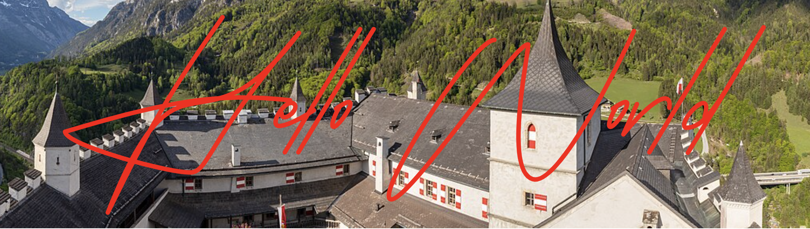

### About original Project readme.md
https://github.com/jrenc2002/GenLineAnimation-Server/blob/master/README.md


#### For this forked project, i'm adding a new feature to allow the user to add background image to the animation.

#### Useage:
```bash
https://localhost:3000/signature?name=John&background=https://example.com/bg.png
```

#### Example:

```bash
http://localhost:3000/signature?name=Hello%20%20World!&background=https://upload.wikimedia.org/wikipedia/commons/thumb/2/2d/Castillo_de_Hohenwerfen%2C_Werfen%2C_Austria%2C_2019-05-17%2C_DD_143-149_PAN.jpg/1362px-Castillo_de_Hohenwerfen%2C_Werfen%2C_Austria%2C_2019-05-17%2C_DD_143-149_PAN.jpg&animate=true&speed=2&color=%23FF0000
```   

